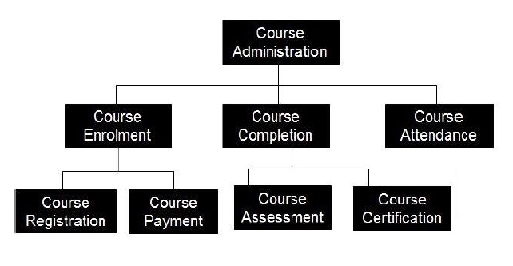

# DECOMPOSİTİON
## NE ?
Decomposition (ayrıştırma) karmaşık bir sorunu veya sistemi , kavranması, anlaşılması, programlanması ve bakımı daha kolay parçalara bölünmesi gerekliliğini gösteren bir prensiptir.Buna kısaca böl ve fethet (divide and conquer) denilmektedir.

Ayrıca

Fonksiyonel ayrıştırma: Büyük ve karmaşık fonksiyonlar bu yöntemle daha küçük ve anlaşılabilir alt fonksiyonlara ayrılırlar. Bu yüzden Yapısal Programlamaya daha yakındır ve Nesne yönelimli programlamadan biraz uzaklaştırabilir. Genellikle analiz aşamasında diagram şeklinde üretilirler. İlk seviye bileşenler ve fonksiyonları ayrıştırılarak başlanır. İstenilen detayda alt seviyelere inildiğinde işlem durdurulur.

## NEDEN ?

Geliştiricilerin çoğunun birçok sorumluluğu olan devasa işlevleri var.Çok sayıda küçük yöntem oluşturmanın çok az dezavantajı ve birçok olumlu yönü var.Olumlu yönleri yeniden kullanımı daha kolaydır.Test etmek daha kolaydır..Okuması ve anlaması daha kolay.Hata ayıklamak daha kolaydır.
 IDE'niz size bunu daha hızlı hale getirmek için yeniden düzenleme yapan bir özüt yöntemi verecektir.

## NASIL ?

 Bir programı bir dizi parça olarak organize etmek için bir stratejidir ve genellikle bir program metnini organize etmenin belirli bir yolunu ima eder. Genellikle bir decomposition kullanmanın amacı, programın karmaşıklığını ve sürdürülebilirliğini optimize etmektir.

Decomposition, bu parçalar arasındaki statik bağımlılıkları engellemek bu yüzden parçalara ayırmayı önerir.

