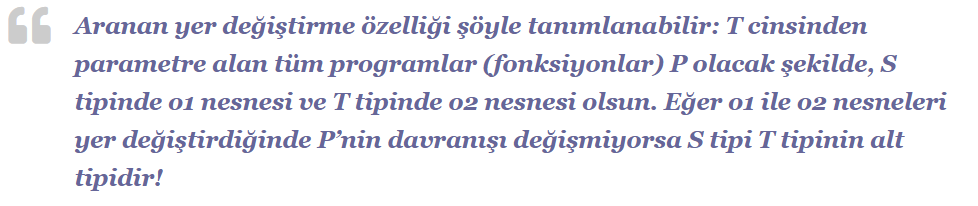
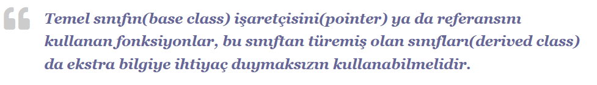

# LİSKOV SUBSİTUTE PRİNCİPLE

## NE ?
Alt sınıflardan oluşturulan nesneler üst sınıfların nesneleriyle yer değiştirdiklerinde aynı davranışı göstermek zorundadırlar. türemiş sınıf nesnelerinin taban sınıf nesnesi yerine geçmesini öngörür. Daha açık bir ifadeyle, taban sınıf türündeki nesne üzerinden operasyon yapacak şekilde geliştirilmiş bir fonksiyon, bu sınıftan türeyen farklı sınıflara ait nesneler üzerinde de aynı operasyonu yapabilmelidir.

## NEDEN ?

LSP’ye göre herhangi bir sınıf kullanıcısı, bu sınıfın alt sınıfları kullanmak için özel bir efor sarf etmek zorunda kalmamalıdır. Onun bakış açısından üst sınıf ve alt sınıf arasında farklılık yoktur.Üst sınıf nesnelerinin kullanıldığı metotlar içinde alt sınıftan olan nesneler aynı davranışı sergilemek zorundadır

## NASIL ? 

Oluşturulan metotlar üst sınıf davranışları örnek alınarak programlanmıştır.Kullanıcı sınıflar ideal durumda alt sınıfların varlığından haberdar bile olmamalıdır.

## KİM?

Barbara Liskov adlı hanımefendi tarafından 1988 yılında ‘Data Abstraction and Hierarchy’ isimli kitabında bu prensip gündeme getirilmiştir.

Barbara Liskov’a göre;

‘Uncle Bob’ lakaplı Robert Cecil Martin ise LSP’yi daha anlaşılır bir vaziyette aşağıdaki gibi izah etmiştir;

